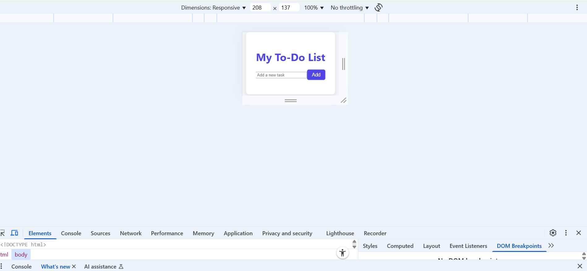
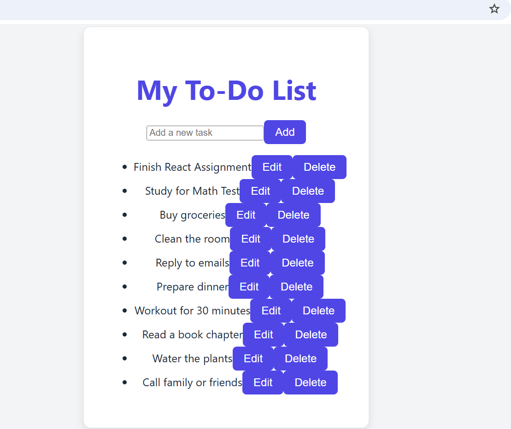

# React To-Do App ✅

A simple and interactive To-Do List application built with **React** and **Vite**.  
You can add, edit, delete, and mark tasks as complete. The app is styled with responsive design for mobile and desktop.
---

## 📸 Screenshots
### Desktop View



---

## 📂 Features
- ➕ Add new tasks
- ✏️ Edit existing tasks
- ✅ Mark tasks as complete/incomplete
- ❌ Delete tasks
- 📱 Mobile-friendly and responsive
---

## 🛠️ Technologies Used
- React (Vite)
- CSS (custom styling + media queries)
- JavaScript (ES6+)
- HTML5
---

## 📦 Installation
To run this project locally:

```bash
# Clone the repository
git clone https://github.com/jain-ati/react-todo-app.git

# Navigate into the project directory
cd react-todo-app

# Install dependencies
npm install

# Start the development server
npm run dev

🙋‍♀️ Author
Anshika Jain
Made with ❤️ for learning and improving skills.
